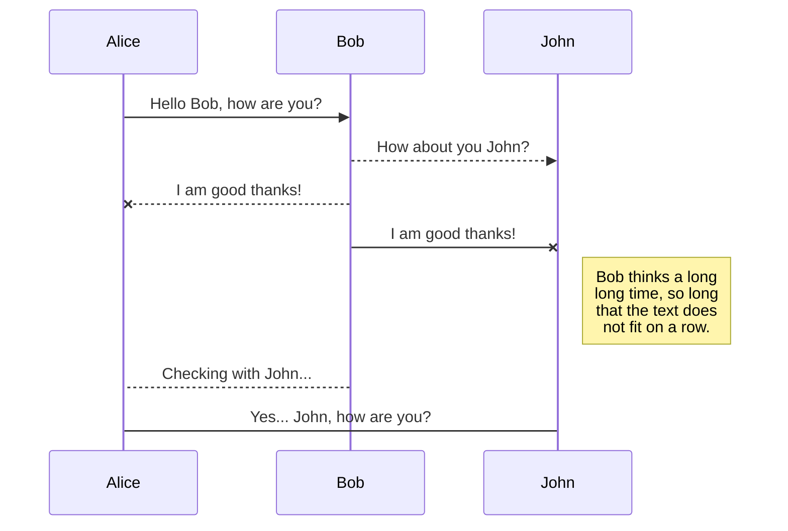
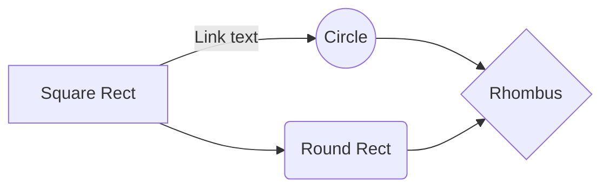

# Traffic Light Demo

First Project of CECS 447 from California State University, Long Beach Fall 2016.

# About

The project cycles through states to simulate traffic light at a four way intersection. 

 * A Green Light State will be active for 3 seconds
 * A Yellow Light State will be active for 0.5 seconds
 * A Red Light State will be active for the 3.5 seconds

## Set Up

The firmware was designed for the Texas Instrument TMC123GHPM Launchpad Development Board

East facing red light connected to PB5											
East facing yellow light connected to PB4										
East facing green light connected to PB3										

North facing red light connected to PB2											
North facing yellow light connected to PB1										
North facing green light connected to PB0										
																																
North facing car detector connected to PE1 (1=car present)		
East facing car detector connected to PE0 (1=car present)		

You can render UML diagrams using [Mermaid](https://mermaidjs.github.io/). For example, this will produce a sequence diagram:

And this will produce a flow chart:

